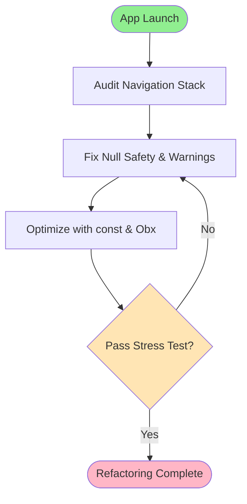

# Feature Specification: Global Refactoring & Optimization

**Feature Branch**: `001-global-refactor`  
**Created**: 2026-08-16  
**Status**: Draft  
**Input**: User description: "Tolong perbaiki seluruh project ini dari sisi code + lakukan strestest + perbaiki yang masih kurang tepat, belum sesuai, smell code, dan semuanya yang menyebabkan error tak terlihat, performa yang lama, penyebab lag, penyebab crash, page yang tidak tertutup atau ter pop dan sebagainya"

## User Scenarios & Testing *(mandatory)*

### User Story 1 - Resolve App Crashes & Memory Leaks (Priority: P1)

As a user, I want the application to be completely stable and free from hidden crashes or unhandled exceptions, so that I don't lose data or get interrupted.

**Why this priority**: Application stability is paramount. Hidden crashes and memory leaks degrade user trust immediately.

**Independent Test**: Can be tested by running automated stress tests and navigating repeatedly through complex screens without observing OOM (Out of Memory) or app termination.

**Acceptance Scenarios**:

1. **Given** the app is under heavy navigation load, **When** switching screens rapidly, **Then** memory usage remains stable and no crashes occur.
2. **Given** a missing or null value from local storage, **When** the app tries to read it, **Then** it gracefully falls back without throwing a NullPointerException.

---

### User Story 2 - UI Optimization & Lag Reduction (Priority: P2)

As a user, I want smooth 60fps scrolling and instant transitions, so that the app feels premium and responsive.

**Why this priority**: Visual lag (jank) directly affects the perceived quality. The user requested fixing "performa yang lama, penyebab lag".

**Independent Test**: Use Flutter DevTools Performance view to verify no UI frames take longer than 16ms to render.

**Acceptance Scenarios**:

1. **Given** a list of items, **When** scrolling rapidly, **Then** no frame drops are recorded in the timeline.
2. **Given** a reactive state change, **When** the state updates, **Then** only the specific widget bound via `Obx` rebuilds, rather than the entire page.

---

### User Story 3 - Navigation & Memory Management (Priority: P3)

As a user, I want pages to close correctly when I press back or finish a task, so that I don't see overlapping screens or experience slowdowns.

**Why this priority**: The user explicitly mentioned "page yang tidak tertutup atau ter pop" (pages not closing/popping properly). 

**Independent Test**: Navigate deep into the app and trigger a pop. Verify the GetX controller is deleted from memory.

**Acceptance Scenarios**:

1. **Given** an open detail page, **When** the user taps 'Back', **Then** the page is popped and its associated GetX controller's `onClose` is called.

### Edge Cases

- What happens when the device runs out of local storage space during a database write?
- How does the system handle rapid double-taps on navigation buttons?

## Requirements *(mandatory)*

### Functional Requirements

- **FR-001**: System MUST handle all null-safety warnings and ensure no bang operator (`!`) is used unsafely.
- **FR-002**: System MUST correctly manage GetX routing, ensuring `Get.off()` or `Get.back()` are used appropriately to prevent stack buildup.
- **FR-003**: System MUST remove all "code smells", unused imports, and dead code across the `lib/` directory.
- **FR-004**: System MUST ensure all static widgets are prefixed with the `const` keyword to optimize the rendering pipeline.

### Non-Functional Requirements

- **NFR-001**: The application must maintain a stable 60 FPS on release builds.
- **NFR-002**: Maximum memory footprint must not continuously grow during rapid navigation (no memory leaks).
- **NFR-003**: Controller instantiation should be lazy (`Get.lazyPut`) where applicable to reduce startup time.

## Success Criteria *(mandatory)*

### Measurable Outcomes

- **SC-001**: Zero `flutter analyze` warnings or errors remaining in the codebase.
- **SC-002**: Zero unhandled exceptions during a 5-minute automated or manual navigation stress test.
- **SC-003**: UI frame rendering times are consistently under 16ms.

## UI/UX & Screens

### Design Reference

- **Design source**: N/A (Refactoring existing UI)
- **Look & feel / brand**: No visual redesign; focusing purely on underlying performance.

### Screen Inventory

| Screen | Purpose | Serves story | Key data shown | Primary actions |
| ------ | ------- | ------------ | -------------- | --------------- |
| All Screens | Refactoring target | US1, US2, US3 | N/A | N/A |

### Per-Screen Key States

- **All Screens**: Ensure that loading, empty, and error states (if applicable) do not cause infinite rebuild loops.

### Primary Interactions & Flows

- Navigation flows (Get.to, Get.off, Get.back) will be audited and corrected to prevent memory leaks and zombie pages.

## Business Process Flow *(visual aid)*

### Primary User Journey Flow

## Business Actors & Interactions

| Actor | Role | Key Interactions |
| ----- | ---- | ---------------- |
| User | End User | Interacts with the app continuously; expects no lag or crashes. |
| System | Flutter App | Renders UI at 60fps, manages memory, executes routing cleanly. |
