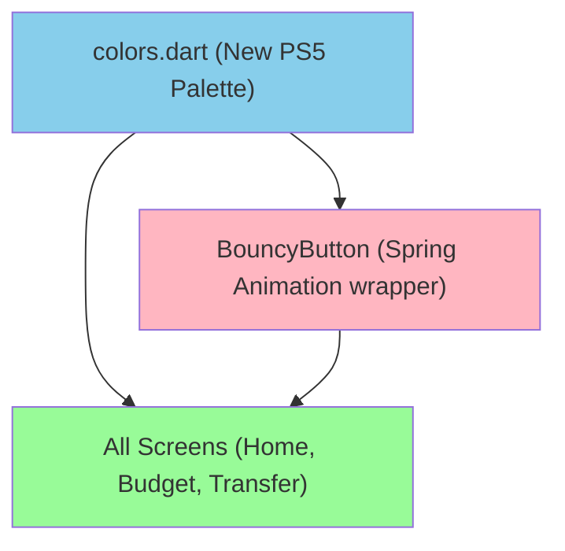

# Implementation Plan: Astro Bot Theme Redesign

**Branch**: `main` | **Date**: 2026-08-16 | **Spec**: [specs/astro-theme/spec.md](file:///d:/VicoTriansyah/project_pribadi/mobile/artavia/specs/astro-theme/spec.md)
**Input**: Feature specification from `/specs/astro-theme/spec.md`

## Summary

Apply the Astro Bot visual themes (PS5 colors, high-contrast neons, clean geometry, and bouncy/tactile micro-animations) to the mobile application. This includes overhauling `colors.dart`, replacing standard containers/buttons with spring-animated equivalents, and using highly rounded border radiuses.

## Technical Context

**Language/Version**: Dart (Flutter)
**Primary Dependencies**: Flutter SDK, GetX
**Storage**: N/A (UI overhaul only)
**Testing**: Flutter unit/widget tests
**Target Platform**: Mobile (Android/iOS)
**Project Type**: Mobile Application
**Architecture Type**: Standalone mobile app using GetX
**Integration Target**: N/A
**Existing Design System**: Uses a custom "BMW dashboard" dark theme (`colors.dart`) with `colorBackground`, `colorCard`, `colorAccent`, etc. This will be completely replaced.
**Performance Goals**: 60 fps (crucial for fluid animations)
**Constraints**: Must use `const` and granular `Obx` (per Phase 1 refactoring) to avoid UI lag.
**Scale/Scope**: Impacts all screens globally.

## UI/UX & Screens (carried from spec)

- **Design reference**: Astro Bot (PS5) and PlayStation 5 System UI aesthetics.
- **Screens**: 
  - All Screens → Apply visual overhaul → Populated (Clean backgrounds, floating rounded cards, glowing accents), Interactive (Spring physics on tap)
- **Primary interactions/flows**: Tap down scales element to 0.95, tap up springs back to 1.0 with overshoot. Transitions use elastic curves.

## Constitution Check

*GATE: Passed*
- Does not violate "Local-Only Mobile Architecture" (no APIs introduced).
- Adheres to "UI Optimization" (const constructors must be used where possible; animations must be lightweight).

## Project Structure

### Documentation (this feature)

```text
specs/astro-theme/
├── spec.md              
├── plan.md              
└── tasks.md             
```

### Source Code (repository root)

```text
lib/
├── widgets/
│   ├── commons/
│   │   ├── colors.dart         # To be completely overhauled
│   │   ├── common.dart         # Minor updates for border radiuses
│   └── components/
│       └── bouncy_button.dart  # NEW: Reusable bouncy wrapper
└── page/
    ├── home/                   # Update widgets to use bouncy button
    ├── budget/                 # Update cards
    ├── transfer/               # Update buttons
    └── ...
```

**Structure Decision**: Modifying the existing `widgets/commons/colors.dart` and introducing a new `bouncy_button.dart` component for widespread use across feature folders.

## Technical Diagrams

### Data Design Decisions

N/A - This is purely a UI/frontend redesign. No database changes.

### UI Architecture


