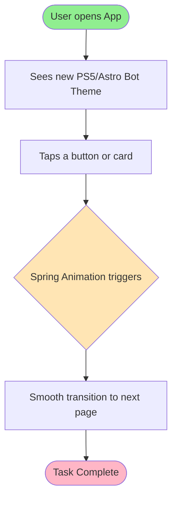

# Feature Specification: Astro Bot Theme Redesign

**Feature Branch**: `main` (as requested by user)
**Created**: 2026-08-16
**Status**: Draft
**Input**: User description: "Gunakan visual tersebut ke aplikasi ini dari sisi estetika, palet warna, Desain dan sejenisnya. Dan jalankan /rudis.ultimate"

## User Scenarios & Testing *(mandatory)*

### User Story 1 - Apply Playful, Tactile UI Elements (Priority: P1)

As a user, I want the app's components (buttons, cards, menus) to feel tactile and bouncy (spring physics), so that interacting with the app feels as satisfying and high-quality as a modern toy/game.

**Why this priority**: The core of the Astro Bot aesthetic is the "feel" of the interactions. Static colors are not enough; the animation and feedback are paramount.

**Independent Test**: Can be tested by tapping any primary button and observing a spring-based scale down/up animation, rather than a rigid color change.

**Acceptance Scenarios**:

1. **Given** a user is on the Home Screen, **When** they tap a transaction card or action button, **Then** the UI responds with a bouncy, tactile micro-animation (e.g., using `AnimatedContainer` with spring curves).
2. **Given** a page transition occurs, **When** navigating between screens, **Then** the transition feels smooth and slightly elastic, replacing the default linear slide.

---

### User Story 2 - Adopt PS5 / Astro Bot Color Palette (Priority: P1)

As a user, I want the app to use a clean, vibrant palette featuring PS5 White, Deep Black, and vibrant Cyan/Blue accents, so that the app visually matches the Astro Bot futuristic-yet-friendly aesthetic.

**Why this priority**: Colors are the most immediate visual indicator of the theme. The current "BMW dark dashboard" theme needs to be completely replaced.

**Independent Test**: Can be tested by viewing the `colors.dart` file and verifying the new palette is applied globally without breaking readability.

**Acceptance Scenarios**:

1. **Given** the app is running, **When** viewing the main screens, **Then** the background uses a clean bright or dark futuristic theme (PS5 white or deep space black) with vibrant neon-blue/cyan accents instead of the old BMW palette.
2. **Given** an expense or income is shown, **When** the color is displayed, **Then** it uses highly saturated, playful colors (e.g., neon red for expense, vibrant green/cyan for income) that stand out against the clean background.

---

### User Story 3 - Implement 'Vibrant & Friendly' Typography and Shapes (Priority: P2)

As a user, I want the text and containers to use rounded, friendly shapes, so that the app feels approachable and modern.

**Why this priority**: Sharp edges and overly formal typography clash with the Astro Bot theme.

**Independent Test**: Can be tested by visually inspecting border radiuses on all cards and verifying the font family is rounded (e.g., Nunito or a similar geometric rounded font).

**Acceptance Scenarios**:

1. **Given** any card or dialog, **When** it is rendered, **Then** it possesses significant rounded corners (e.g., radius 16 to 24) and subtle, soft drop shadows.
2. **Given** text is displayed, **When** reading headings, **Then** they use a bold, friendly typography style.

## Requirements *(mandatory)*

### Functional Requirements

- **FR-001**: System MUST update the global color palette (`lib/widgets/commons/colors.dart`) to the Astro Bot theme (PS5 White, Cyan, deep contrast).
- **FR-002**: System MUST replace standard linear animations with spring-based (bouncy) physics animations for all primary buttons and interactive cards.
- **FR-003**: System MUST update all `BorderRadius` values across the app to be highly rounded (e.g., `BorderRadius.circular(20)`).
- **FR-004**: System MUST update iconography to feel more playful and thick-lined, aligning with the PlayStation aesthetic (using rounded icons).
- **FR-005**: System MUST ensure that the new color palette maintains WCAG AA contrast standards for readability.

### Non-Functional Requirements

- **NFR-001**: The introduction of new animations MUST NOT cause the UI to drop below 60 FPS on standard devices (must remain highly optimized using `const` and `GetView`).

## Success Criteria *(mandatory)*

### Measurable Outcomes

- **SC-001**: 100% of the old "BMW dashboard" color variables in `colors.dart` are replaced or repurposed.
- **SC-002**: All primary interactive elements (at least Home, Transfer, Budget, Report screens) implement bouncy touch feedback.
- **SC-003**: No UI jank introduced (measured via Flutter DevTools maintaining <16ms frame build times).

## UI/UX & Screens *(mandatory when the feature has a user interface)*

### Design Reference

- **Design source**: Astro Bot (PS5) and PlayStation 5 System UI aesthetics.
- **Look & feel / brand**: Clean, tactile, futuristic toy, vibrant accents, rounded geometry, spring physics.
- **Existing UI to match**: Complete overhaul of the current dark/BMW theme to this new bright/neon-accented theme.

### Screen Inventory

| Screen | Purpose | Serves story | Key data shown | Primary actions |
| ------ | ------- | ------------ | -------------- | --------------- |
| All Screens | Apply visual overhaul | US1, US2, US3 | Standard app data | Interactions with bouncy feedback |

### Per-Screen Key States

- **All Screens**: 
  - Populated: Clean white/black backgrounds, floating rounded cards, glowing accents.
  - Interactive: Buttons compress slightly when tapped and spring back up when released.

### Primary Interactions & Flows

- Tap down: Element scales down slightly (e.g., 0.95 scale).
- Tap up: Element springs back to 1.0 scale with a slight overshoot (bouncy effect).

## Business Process Flow *(visual aid)*

### Primary User Journey Flow

## Business Actors & Interactions

| Actor | Role | Key Interactions |
| ----- | ---- | ---------------- |
| User | End User | Enjoys a highly tactile, playful, and visually pleasing experience while managing finances. |
| System | Flutter App | Renders bouncy animations and vibrant colors efficiently. |
